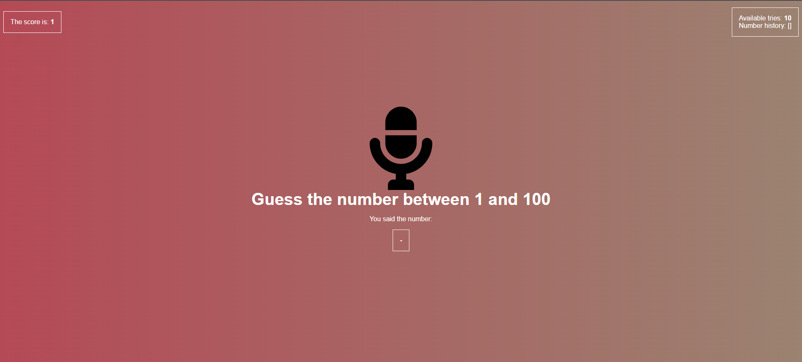

# Guess the number between 1 - 100 based on voice recognition with JS

### Use Instructions ###

1. Clone or fork this repository.
2. Run `yarn`
3. Run `parcel index.html`
4. Don't forget to allow your microphone ;)

   
 ### PREVIEW ###
 
  

